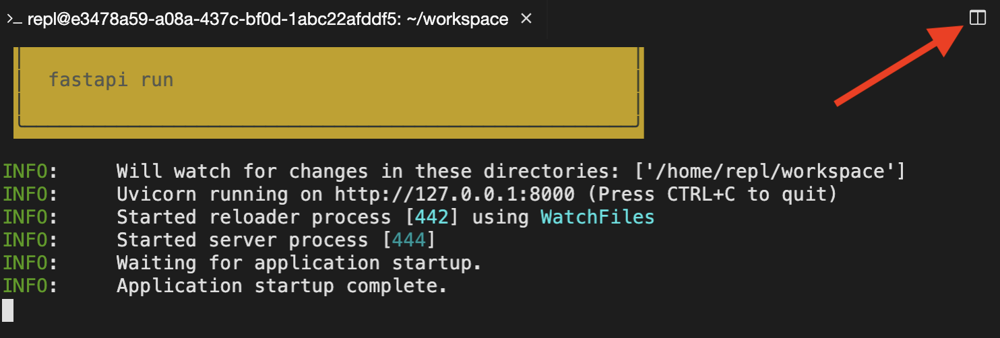

## First application

Let's run the FastAPI server for the first time! You can't run the FastAPI server directly with "Run this file" - see the instructions for how to run and stop the server from the terminal.

### Instructions

1. Run the live server in the bash repl (the terminal at the bottom): `fastapi dev main.py`.
2. Verify the logs in the terminal show `Application startup complete..`
3. Stop the live server by pressing `Control+C`.

```python
main.py

from fastapi import FastAPI

app = FastAPI()


@app.get("/")
def root():
    return {"message": "Hello World"}
```

## FastAPI vs. Django

Classify the features of FastAPI and Django to show their strengths and limitations.

| FastAPI | Django |
| ------- | ------ |
| ORM Optional | ORM build in |
| Build APIs | Build web-based (GUI) apps |

## Hello world

Let's build your first GET endpoint! You can't run the FastAPI server directly with "Run this file" - see the instructions for how to run and stop the server from the terminal.

### Instructions

1. Import FastAPI and instantiate the app server.
2. Run the live server in the terminal: `fastapi dev main.py`.
3. Open a new terminal (top-right of terminal)



4. Test your code with the following command: `curl http://localhost:8000`

```python
main.py

from fastapi import FastAPI

app = FastAPI()


@app.get("/")
def root():
    return {"message": "Hello World"}
```

## Hello who?

Let's build your first GET endpoint that accepts an input! You can't run the FastAPI server directly with "Run this file" - see the instructions for how to run and stop the server from the terminal.

### Instructions

1. Add a query parameter `name` with a default value `"Alan"`.
2. Return a dictionary with the key `message` and the value `"Hello {name}"`.
3. Run the live server in the terminal: `fastapi dev main.py`.
4. Open a new terminal (top-right of terminal) and test your code with the following command: 
```
curl \
  -H 'Content-Type: application/json' \
  http://localhost:8000?name=Steve
```
```python
main.py

from fastapi import FastAPI

app = FastAPI()


@app.get("/")
def root(name: str = "Alan"):
    return {"message": "Hello {name}"}
```

## Pydantic model

You've been asked to create an API endpoint that manages items in inventory. To get started, create a Pydantic model for `Items` that has attributes `name`, `quantity`, and `expiration`.

### Instructions

1. Import `date` from `datetime` and `BaseModel` from `pydantic`.
2. Create a Pydantic model for `Item`.
3. Fill in the following fields correctly: `name` (string), `quantity` (integer, optional, default 0), and `expiration` (date, optional, default None).

```python
script.py

# Import date
from datetime import date

# Import BaseModel
from pydantic import BaseModel

# Define model Item
class Item(BaseModel):
    name: str
    quantity: int = 0
    expiration: date = None
```

## POST operation in action

You've been asked to create an API endpoint that accepts a `name` parameter and returns a message saying "We have `name`". To accomplish this, create a Pydantic model for `Item` and root endpoint (`/`) that serves HTTP POST operations. The endpoint should accept the `Item` model as input and respond with a message including `Item.name`.

You can't run the FastAPI server directly with "Run this file" - see the instructions for how to run the server and test your code from the terminal.

### Instructions

1. Define pydantic model `Item` so that parameter `name` can be passed into the POST body.
2. Run the live server in the terminal: `fastapi dev main.py`.
3. Open a new terminal (top-right of terminal) and test your code with the following command:
```
curl -X POST \
  -H 'Content-Type: application/json' \
  -d '{"name": "bananas"}' \
  http://localhost:8000
```
```python
main.py

from fastapi import FastAPI
from pydantic import BaseModel

# Define model Item
class Item(BaseModel):
    name: str

app = FastAPI()


@app.post("/")
def root(item: Item):
    name = item.name
    return {"message": f"We have {name}"}
```

## PUT operation in action

You've been asked to create a PUT endpoint `/items` that accepts parameters `name` and `description` and updates the `description` based on the `name` in a key-value store called `items`.

You can't run the FastAPI server directly with "Run this file" - see the instructions for how to run the server and test your code from the terminal.

### Instructions

1. Define pydantic model `Item` so that parameters `name` and `description` can be passed into the PUT body.
2. Update `description` in `items` based on the key `name`.
3. Run the live server from the terminal: `fastapi dev main.py`.
4. Open a new terminal (top-right of terminal) and test your code with the following command:
```
curl -X PUT \
  -H 'Content-Type: application/json' \
  -d '{"name": "bananas", "description": "Delicious!"}' \
  http://localhost:8000/items
```

```python
main.py

from fastapi import FastAPI
from pydantic import BaseModel

# Define model Item
class Item(BaseModel):
    name: str
    description: str

# Define items at application start
items = {"bananas": "Yellow fruit."}

app = FastAPI()


@app.put("/items")
def update_item(item: Item):
    name = item.name
    # Update the description
    items[name] = item.description
    return item
```
